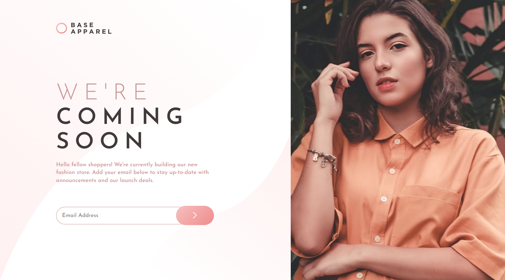

# Frontend Mentor - Base Apparel coming soon page solution

This is a solution to the [Base Apparel coming soon page challenge on Frontend Mentor](https://www.frontendmentor.io/challenges/base-apparel-coming-soon-page-5d46b47f8db8a7063f9331a0). Frontend Mentor challenges help you improve your coding skills by building realistic projects.

## Table of contents

- [Overview](#overview)
  - [The challenge](#the-challenge)
  - [Screenshot](#screenshot)
  - [Links](#links)
  - [Built with](#built-with)
  - [Useful resources](#useful-resources)
  - [Author](#author)

**Note: Delete this note and update the table of contents based on what sections you keep.**

## Overview

### The challenge

Users should be able to:

- View the optimal layout for the site depending on their device's screen size
- See hover states for all interactive elements on the page
- Receive an error message when the `form` is submitted if:
  - The `input` field is empty
  - The email address is not formatted correctly

### Screenshot

### Links

- Solution URL: [Github](https://github.com/tehseen01/Base-Apparel-coming-soon-page.git)
- Live Site URL: [Netlify](https://ishan-Base-Apparel-coming-soon-page.netlify.app)

### Built with

- Semantic HTML5 markup
- CSS custom properties
- Flexbox
- CSS Grid
- Mobile-first workflow
- javaScript

### Useful resources

- [Form validation](https://developer.mozilla.org/en-US/docs/Learn/Forms/Form_validation#validating_forms_using_javascript)
- [Re-ordering Grid items](https://youtu.be/rBoveH7tdJU) - This video help me to revers items in grid just like flex-direction row or column-reverse

## Author

- Website - [Add your name here](https://ishanv1.netlify.app)
- Frontend Mentor - [@tehseen01](https://www.frontendmentor.io/profile/tehseen01)
- Instagram - [@tehseen.01](https://www.instagram.com/tehseen.01)
